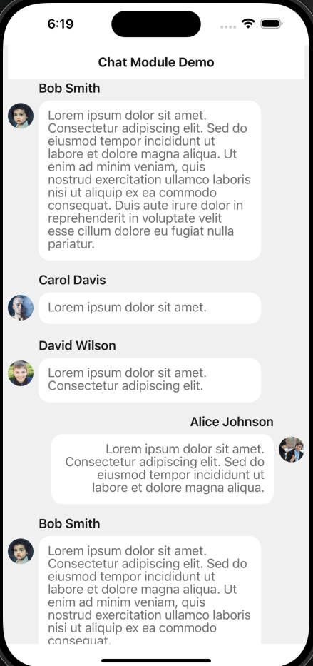

# Chat Module - React Native Expo App

A modern chat application built with React Native Expo, featuring real-time messaging, user avatars, and infinite scrolling with TanStack Query.




## Features

- 💬 **Real-time Chat Interface** - Modern messaging UI with user avatars
- 🔄 **Infinite Scrolling** - Smooth pagination with TanStack Query
- 👥 **User Management** - Multiple users with avatars and online status
- 📱 **Responsive Design** - Optimized for mobile with Tamagui components
- 🎨 **Modern UI** - Clean, intuitive chat interface
- ⚡ **Performance** - Efficient data fetching and caching
- 🔧 **TypeScript** - Type-safe development throughout

## Project Structure

```
chat-module/
├── src/
│   ├── components/
│   │   └── ChatMessage.tsx          # Individual chat message component
│   ├── hooks/
│   │   └── useChatMessages.ts       # Chat messages data fetching hook
│   ├── providers/
│   │   └── QueryProvider.tsx        # TanStack Query provider
│   └── screens/
│       └── HomeScreen.tsx           # Main chat screen
├── images/                          # Project screenshots and demos
├── App.tsx                          # Main app component
└── package.json
```

## Getting Started

### Prerequisites

- Node.js (v18 or higher)
- pnpm (v8 or higher)
- Expo CLI
- iOS Simulator (for iOS development)
- Android Studio (for Android development)

### Installation

1. **Clone the repository**

   ```bash
   git clone <repository-url>
   cd chat-module
   ```

2. **Install dependencies**

   ```bash
   pnpm install
   ```

3. **Start the development server**

   ```bash
   pnpm start
   ```

4. **Run on your preferred platform**

   ```bash
   # iOS
   pnpm ios

   # Android
   pnpm android

   # Web
   pnpm web
   ```

## Key Components

### ChatMessage Component

The `ChatMessage` component renders individual chat messages with:

- User avatars (with fallback to initials)
- Message bubbles with proper alignment
- User names and timestamps
- Responsive text wrapping
- Different styling for user vs other messages

```typescript
interface ChatMessageProps {
  message: ChatMessageType;
  isUser: boolean;
}
```

### useChatMessages Hook

Custom hook that provides infinite scrolling chat messages:

- Paginated data fetching
- Loading states
- Error handling
- Automatic caching with TanStack Query

```typescript
const { data, isLoading, error, fetchNextPage, hasNextPage } =
  useChatMessages();
```

## Technology Stack

- **React Native Expo** - Cross-platform mobile development
- **TanStack Query** - Data fetching and caching
- **Tamagui** - Modern UI component library
- **TypeScript** - Type-safe development
- **ESLint & Prettier** - Code quality and formatting

## Development Tools

### Available Scripts

```bash
# Development
pnpm start          # Start Expo development server
pnpm ios            # Run on iOS simulator
pnpm android        # Run on Android emulator
pnpm web            # Run on web browser

# Code Quality
pnpm lint           # Run ESLint
pnpm lint:fix       # Run ESLint with auto-fix
pnpm format         # Format code with Prettier
pnpm format:check   # Check code formatting
pnpm type-check     # Run TypeScript type checking
```

## Data Structure

### Chat Message Interface

```typescript
interface ChatMessage {
  id: string;
  content: string;
  timestamp: Date;
  userId: string;
  user: ChatUser;
}

interface ChatUser {
  id: string;
  name: string;
  avatar?: string;
}
```

### Mock Data

The app includes mock data for demonstration:

- 4 different users with avatars
- 1000+ generated messages
- Realistic timestamps and content
- Infinite scrolling simulation

## Customization

### Adding Real API Integration

1. Replace mock data in `useChatMessages.ts`
2. Update the `fetchChatMessages` function
3. Add real authentication
4. Implement WebSocket for real-time updates

### Styling Customization

- Modify Tamagui theme in `tamagui.config.ts`
- Update component styles in individual files
- Customize colors, spacing, and typography

### Adding Features

- **Real-time messaging**: Integrate WebSocket
- **File attachments**: Add image/file upload
- **User presence**: Show online/offline status
- **Message reactions**: Add emoji reactions
- **Voice messages**: Implement audio recording

## Performance Optimizations

- **Infinite scrolling**: Efficient pagination
- **Image optimization**: Proper avatar loading
- **Memoization**: React.memo for expensive components
- **Query caching**: TanStack Query for data management

## Troubleshooting

### Common Issues

1. **Metro bundler issues**: Clear cache with `pnpm start --clear`
2. **TypeScript errors**: Run `pnpm type-check` to identify issues
3. **Linting errors**: Run `pnpm lint:fix` to auto-fix issues
4. **Image loading**: Check avatar URLs and network connectivity

### Performance Tips

- Use `React.memo` for message components
- Implement proper key props for message lists
- Optimize image sizes and formats
- Use React Query's caching effectively

## Contributing

1. Fork the repository
2. Create a feature branch
3. Make your changes
4. Run linting and formatting
5. Submit a pull request

## License

This project is licensed under the MIT License.
